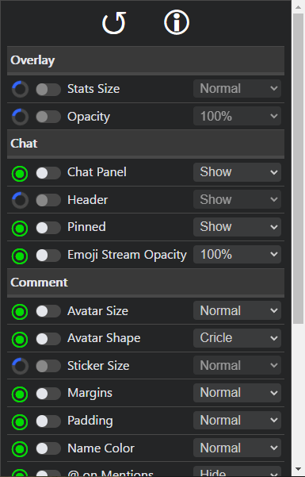
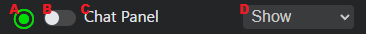

# Facebook Gaming Enhancement Suite
FBGES is a browser extension to improve the user interface for Facebook Gaming.

```
THIS EXTENSION IS NOT CREATED BY FACEBOOK OR ASSOCIATED WITH FACEBOOK IN ANY WAY. DO NOT CONTACT THEM FOR SUPPORT!
```

```
THIS EXTENSION IS IN BETA. EXPECT BUGS AND PLEASE REPORT ISSUES TO THE AUTHOR. THANKS!
```

## Installation
The plan is to make the extension available from the Chrome web store, but right now the extension must be installed by downloading the [latest release](https://github.com/CivBase/facebook-gaming-enhancement-suite/releases). The plan is to add Firefox support soon(tm), but right now only Chrome is supported.

## Usage
The design of the user interface for Facebook Gaming is contentious and lacks customization options. Instead of re-designing the interface according to the author's preferences, the Facebook Gaming Enhancement Suite makes it easy for users to fine-tune aspects of the interface themselves. Simply navigate to a Facebook Gaming stream in your browser, then open the extension to access the controls.



Each control has a name (C), a toggle to enable or diable it (B), and a dropdown menu to allow users to customize the page (D). For example, a user could hide the chat pannel by toggling it on and selecting "Hide" from the dropdown menu.



Unfortunately, Facebook's web interface is designed in such a way that it is difficult to identify things using code. A control can only be configured once the page has found the corresponding item(s). To the far left of each control is an icon (A) which indicates the current search status.


A spinning blue ring indicates that the extension is currently searching for items associated with the control. A spinning yellow ring indicates that the extension is searching for items, but might be able to identify the items using data from a previous session. A green ring with a dot indicates that the relevant items have been detected. A red ring with a cross indicates that the relevant items could not be found.

The reset button at the top allows you to clear all stored data and restart the searches for all controls.

## Controls
Each control allows you to customize something different on the page. Here is a brief description about what each control is for and what the author recommends.

Control              | Description                                                                      | Suggestion
-------------------- | -------------------------------------------------------------------------------- | ----------
Stats Size           | Size of the "LIVE" badge and viewer count in the top-left of the video overlay.  | Small     
Opacity              | Transparency of the video overlay controls.                                      | 50%       
Chat Panel           | Whether the chat panel is displayed.                                             | Show      
Header               | Whether the header at the top of the chat panel is displayed.                    | Hide      
Pinned               | Whether pinned comments are displayed.                                           | Show      
Emoji Stream Opacity | Transparency of the floating emoji "stream" thing on the right side of the chat. | 50%       
Avatar Size          | Size of user avatar images in chat.                                              | Tiny      
Avatar Shape         | Shape of user avatar images in chat.                                             | Square    
Sticker Size         | Size of stickers in chat.                                                        | Tiny      
Margins              | Amount of empty space around chat bubbles.                                       | Tiny      
Padding              | Amount of empty space inside chat bubbles.                                       | Tiny      
Name Color           | Color of usernames in chat messages.                                             | Orange    
@ on Mentions        | Whether to show "@" before mentions in chat messages.                            | Show      
Mention Color        | Color of mentions in chat messages.                                              | Blue      
Reactions            | Whether to show reaction icons on chat bubbles.                                  | Show      
Like                 | Whether to show the "Like" lins that normally go below chat bubbles.             | Show      
Timestamp            | Whether to show timestamps that normally go below chat bubbles.                  | Hide      
Location             | Where to put links that normally go below chat bubbles.                          | Right     
Opacity              | Transparency of the links that normally go below chat bubbles.                   | 50%       
